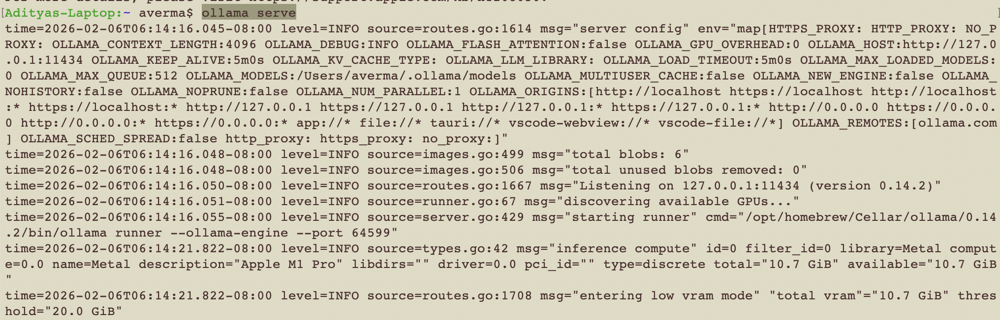
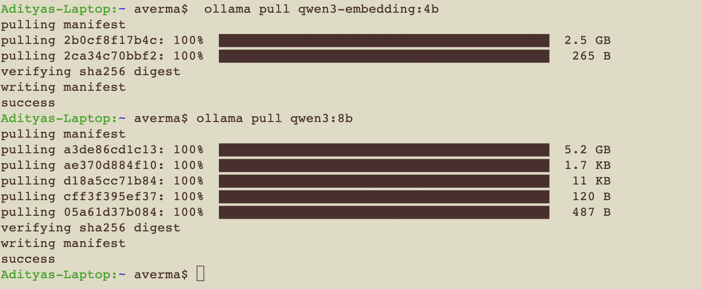
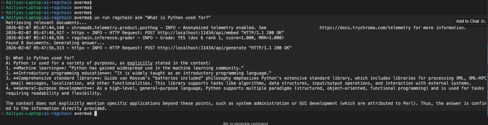

# RAGChain Demo Screenshots

This document shows the complete workflow of setting up and using the RAGChain system.

---

## Complete Workflow Summary

1. **Setup Environment**
   - Install Ollama
   - Pull embedding and generation models
   - Start Chroma vector database

2. **Ingest Documents**
   - `uv run ragchain ingest`
   - Loads Wikipedia articles for 50+ programming languages
   - Generates embeddings and stores in Chroma

3. **Ask Questions**
   - `uv run ragchain ask "your question"`
   - Intent classification → Retrieval → Grading → Answer generation
   - Returns context-grounded responses

---

## Commands Used

```bash
# 1. Start Ollama
ollama serve

# 2. Pull models
ollama pull qwen3-embedding:4b
ollama pull qwen3:8b

# 3. Start Chroma (in another terminal)
docker compose up -d

# 4. Ingest documents
uv run ragchain ingest

# 5. Ask questions
uv run ragchain ask "What is Python used for?"
uv run ragchain ask "Compare Go and Rust"
uv run ragchain ask "What are the top 10 languages?"
```

---

## System Requirements

- **Disk Space**: ~10 GB (models + data)
- **RAM**: 8 GB minimum, 16 GB recommended
- **Ollama Models**: 
  - `qwen3-embedding:4b` (2.5 GB)
  - `qwen3:8b` (5.2 GB)
- **Docker**: For Chroma vector database

---

## 1. Setup: Starting Ollama and Pulling Models



**What's shown:**
- Starting the Ollama service (`ollama serve`)
- Ollama server starting on port 11434
- Pulling the required models:
  - `qwen3-embedding:4b` (2.5 GB) - For generating embeddings
  - `qwen3:8b` (5.2 GB) - For text generation
- Models successfully downloaded and ready to use

**Key details:**
- Ollama runs locally at `http://localhost:11434`
- Models are cached locally for offline use
- Total download size: ~7.7 GB

---

## 2. Pulling Embedding and Generation Models



**What's shown:**
- Complete model download process
- `qwen3-embedding:4b` successfully pulled (2.5 GB embedding model)
- `qwen3:8b` successfully pulled (5.2 GB generation model)
- Models verified and ready for use

**Command used:**
```bash
ollama pull qwen3-embedding:4b
ollama pull qwen3:8b
```

---

## 3. Running RAGChain: Asking Questions



**What's shown:**
- Running a query: `uv run ragchain ask "What is Python used for?"`
- Document retrieval in progress:
  - Chroma telemetry enabled
  - HTTP requests to local Chroma instance at `localhost:11434`
  - Found 8 documents
  - Generating answer with retrieved context

**Generated Answer:**
> "Python is used for a variety of purposes, as explicitly stated in the context:
> 1. Machine learning
> 2. Introductory and advanced education
> 3. Web development
> 4. General-purpose development (via Python's extensive standard library)
> ...and more"

**Key features demonstrated:**
- Full RAG pipeline execution
- Document retrieval from Chroma vector store
- Context-based answer generation
- Faithful responses grounded in retrieved documents

---


## Troubleshooting

If you encounter issues:

1. **Ollama not responding**: Check if service is running on port 11434
2. **Model download fails**: Check network connection and disk space
3. **Chroma connection error**: Verify Docker container is running
4. **Slow responses**: Ensure sufficient RAM is available

For more details, see [README.md](README.md)
